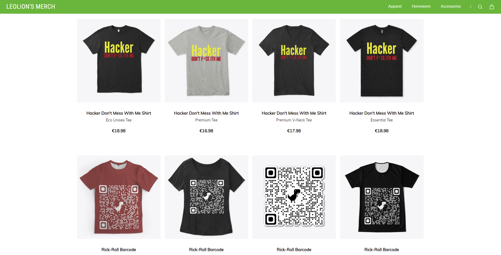

<table style="margin-left: auto; margin-right: auto; text-align:center;">
  <tr>
    <td><a href="#welcome">Welcome</a></td>
    <td><a href="#my-resume">Resume</a></td>
    <td><a href="#tools">Tools</a></td>
    <td><a href="#publications">Publications</a></td>
    <td><a href="#me-etc">More from me</a></td>
    <td><a href="#google-play">Google Play</a></td>
    <td><a href="#contact-section">Contact</a></td>
  </tr>
</table>

<h2 id="welcome">Welcome, friend</h2>

On this website you can find a bunch of useful tools, both for your personal workstation, as well as for your professional life.
This website also serves as my Portfolio, so if you're looking to hire me, or are interested in filing a development request, don't hesitate to use the <a href="#contact-section">contact section below</a>.

*For resources to help you with University subjects, check out my other <a href="https://uni.leolion.tk/" target="_blank">website</a>.*

**All tools provided on this website are free to use and change, misuse however, is prohibited. Any damage caused by these tools, in addition to violations of local restrictions, are your own problem, not mine.** 

<h1 id="my-resume">Who am I?</h1>


{{ p1 | markdownify }}

Wanna know if you should hire me or need a software developed? Check out my interactive digital resume below (or <a href='https://github.com/leolion3/Portfolio/blob/master/CV/' target='_blank' id='digital-resume'>here</a>).

  

  	<b style="color: purple;">Show Resume</b>
  

  

  	
	  {{ p21 | markdownify }}
  

---

<h1 id="tools">Ok, so what's on the menu?</h1>

Well you can stick around and take a look at the list below, or you can go browse the repository!

  

  	<b style="color: limegreen;">Python</b>
  	

  

<!---
	Python MiniHTTP Server
-->
<h3>
	<a href='https://github.com/leolion3/Portfolio/tree/master/Python/MiniHTTPServer' target='_blank' id='mini-http-server'>MiniHTTPServer (Minimal HTTP Server)</a>
</h3>

  

  	<b style="color: purple;">Click to view Details</b>
  

  

  	
	  {{ p21 | markdownify }}
  

  <a href="#mini-http-server">Back to Top</a>

<!---
	Yearly Investment Yield Calculator
-->
<h3>
	<a href='https://github.com/leolion3/Portfolio/tree/master/Python/YearlyYieldCalculator' target='_blank' id='investment-yield-ref'>Investment Yield Calculator</a>
</h3>

  

  	<b style="color: purple;">Click to view Details</b>
  

  

  	
	  {{ p13 | markdownify }}
  

  <a href="#investment-yield-ref">Back to Top</a>

<!---
	Bank Balance Calculator
-->
<h3>
	<a href='https://github.com/leolion3/Portfolio/tree/master/Python/NetworthCalculator' target='_blank' id='bank-balance-ref'>Bank-Balance Calculator</a>
</h3>

  

  	<b style="color: purple;">Click to view Details</b>
  

  

  	
	  {{ p1 | markdownify }}
  

  <a href="#bank-balance-ref">Back to Top</a>

<!---
	Password Vault
-->
<h3>
	<a href="https://github.com/leolion3/Portfolio/tree/master/Python/PasswordVault" target="_blank" id='password-vault-ref'>Python Password Vault</a>
</h3>

  

  	<b style="color: purple;">Click to view Details</b>
  

  

  	
	  {{ p2 | markdownify }}
  

  <a href="#password-vault-ref">Back to Top</a>

<!---
	File Transfer Tool
-->
<h3>
	<a href='https://github.com/leolion3/Portfolio/tree/master/Python/FileSender' target='_blank' id='file-transfer-ref'>Python File Transfer Tool</a>
</h3>

  

  	<b style="color: purple;">Click to view Details</b>
  

  

  	
	  {{ p3 | markdownify }}
  

  <a href="#file-transfer-ref">Back to Top</a>

<!---
	Password Transfer Tool
-->
<h3>
	<a href='https://github.com/leolion3/Portfolio/tree/master/Python/PasswordUtils' target='_blank' id='password-transfer-ref'>Python Password Transfer Tool</a>
</h3>

  

  	<b style="color: purple;">Click to view Details</b>
  

  

  	
	  {{ p20 | markdownify }}
  

  <a href="#password-transfer-ref">Back to Top</a>

<!---
	Spotify Module
-->
<h3>
	<a href='https://github.com/leolion3/Portfolio/tree/master/Python/SpotifyAPI' target='_blank' id='spotify-api-ref'>Python Spotify API Modules</a>
</h3>

  

  	<b style="color: purple;">Click to view Details</b>
  

  

  	
	  {{ p20 | markdownify }}
  

  <a href="#spotify-api-ref">Back to Top</a>

<!---
	Python Ethermine Ticker
-->
<h3>
	<a href='https://github.com/leolion3/Portfolio/tree/master/Python/Ethermine' target='_blank' id='ethermine-ticker-ref'>Ethermine Ticker</a>
</h3>

  

  	<b style="color: purple;">Click to view Details</b>
  

  

  	
	  {{ p4 | markdownify }}
  

  <a href="#ethermine-ticker-ref">Back to Top</a>

<!---
	Monoalphabetic Decypherer
-->
<h3>
	<a href="https://github.com/leolion3/Portfolio/tree/master/Python/MonoalphabeticDecypherer" target="_blank" id='monoalphabetic-decypherer-ref'>Monoalphabetic Decypherer</a>
</h3>

  

  	<b style="color: purple;">Click to view Details</b>
  

  

  	
	  {{ p5 | markdownify }}
  

  <a href="#monoalphabetic-decypherer-ref">Back to Top</a>

<!---
	Reverse Shell
-->
<h3>
	<a href="https://github.com/leolion3/Portfolio/tree/master/Python/PythonReverseShell" target="_blank" id='py-revshell-ref'>Python Reverse Shell</a>
</h3>

  

  	<b style="color: purple;">Click to view Details</b>
  

  

  	
	  {{ p6 | markdownify }}
  

  <a href="#py-revshell-ref">Back to Top</a>

<!---
	Markdown Text Editor
-->
<h3>
	<a href="https://github.com/leolion3/Portfolio/tree/master/Python/Markdown" target="_blank" id='py-texteditor-ref'>Python Markdown/Text Editor</a>
</h3>

  

  	<b style="color: purple;">Click to view Details</b>
  

  

  	
	  {{ p7 | markdownify }}
  

  <a href="#py-texteditor-ref">Back to Top</a>

<!---
	Youtube to MP3
-->
<h3>
	<a href="https://github.com/leolion3/Portfolio/tree/master/Python/YouTube" target="_blank" id='yt-downloader-ref'>YouTube MP3 Downloader</a>
</h3>

  

  	<b style="color: purple;">Click to view Details</b>
  

  

  	
	  {{ p8 | markdownify }}
  

  <a href="#yt-downloader-ref">Back to Top</a>

<!---
	Revshell Payload Generator
-->
<h3>
	<a href="https://github.com/leolion3/Portfolio/tree/master/Python/ShellGenerator" target="_blank" id='powershell-revshell-ref'>Powershell TCP Reverse Shell Generator</a>
</h3>
	

  

  	<b style="color: purple;">Click to view Details</b>
  

  

  	
	  {{ p9 | markdownify }}
  

  <a href="#powershell-revshell-ref">Back to Top</a>

<!---
	Chat spammer
-->
<h3>
	<a href="https://github.com/leolion3/Portfolio/tree/master/Python/ChatSpammer" target="_blank" id='py-chatspammer-ref'>Python Chat Spammer</a>
</h3>

  

  	<b style="color: purple;">Click to view Details</b>
  

  

  	
	  {{ p16 | markdownify }}
  

  <a href="#py-chatspammer-ref">Back to Top</a>

<h3>
	<a href="https://github.com/leolion3/Portfolio/tree/master/Python/Introduction" target="_blank" id='python-introduction-ref'>Python Introduction</a>
</h3>

  

  	<b style="color: purple;">Click to view Details</b>
  

  

  	
	  {{ p10 | markdownify }}
  

  <a href="#python-introduction-ref">Back to Top</a>

  

  	<b style="color: cyan;">Windows Terminal/Batchfile</b>
  	

  

<h3>
	<a href="https://github.com/leolion3/Portfolio/tree/master/Powershell/Customization" target="_blank" id='wt-customization'>Windows Terminal Customization</a>
</h3>
	

		

			<b style="color: purple;">Click to view Details</b>
		

		

			
			{{ p11 | markdownify }}
		

		<a href="#wt-customization">Back to Top</a>
	

<h3>
	<a href="https://github.com/leolion3/Portfolio/tree/master/CustomCommands" target="_blank" id='custom-commands'>Custom Windows Commands and Git Shortcuts</a>
</h3>

		

			<b style="color: purple;">Click to view Details</b>
		

		

			
			{{ p12 | markdownify }}
		

		<a href="#custom-commands">Back to Top</a>
	

  

  	<b style="color: orange;">Linux/Bash</b>
  	

  

  <h3>
		<a href="https://github.com/leolion3/Portfolio/tree/master/Linux/Customization/Oh-My-Zsh" target="_blank" id='terminal-customization'>Customize Terminal with Oh-My-Zsh</a>
	</h3>
	

	

		<b style="color: purple;">Click to view Details</b>
	

		

			
			{{ p10 | markdownify }}
		

		<a href="#terminal-customization">Back to Top</a>
	

	

  

  	<b style="color: yellow;">Etc</b>
  	

  

<h3>
	<a href="https://gist.github.com/leolion3/ccf654ab60c8e110c65ef948da6af461" target="_blank" id="dlu">DLU Lego Universe Server Setup</a>
</h3>

  

  	<b style="color: purple;">Click to view Details</b>
  

  

			
				
			{{ p15 | markdownify }}
	

  <a href="#dlu">Back to Top</a>

<h1 id="publications">Publications</h1>

<h2 id="bachelor-robots">B-More-Human: Dynamic Cheering Reactions for humanoid Football-Robots (Bachelor Thesis)</h2>

The B-Human football robots were incapable of showing emotions during RoboCup games. This has been changed. The process of doing so required various tweaks dozens of code-fragments throughout the B-Human framework and the introduction of various new mechanisms. 

**The thesis can be found <a href="https://leolion3.github.io/University_Stuff/Publications/BA_B-More-Human_leonard_haddad_SoSe22.pdf">here</a>.**

**The thesis was graded with a 1.3 (an A if an A+ is the highest possible grade).**

**\* The professors' assessments can be provided upon request. Long live upon source and free access to information!**

Check out the dancing robots below!

  

  	<b style="color: purple;">See some dancing robots!</b>
  

  

			
			
			
			
			
			
			
			
	

  <a href="#dancing-robots">Back to Top</a>

<h1 id="me-etc">More from Me</h1>

## Teespring Merch

Check out the various cool merch on my <a href='https://leolions-merch.creator-spring.com/' target='_blank'>Teespring store</a>

<!-- Google Play -->
<h2 id="google-play">
  
</h2>

Check out my Google Play Apps!

<ul>
<!-- File transfer tool -->
  <li>
    <h2>
       Open Source Easy File Transfer <a href="https://play.google.com/store/apps/details?id=software.isratech.filetransferos" target="_blank">(Google Play)</a>
    </h2>
    
    
    
    
    
Tired of sending files back and forth through Whatsapp, just to transfer them from your PC to your Phone and vice versa? Would you like an AirDrop equivalent for Android and Windows? Well, this is it! Simply pick the file you want to send, and let the receiving device connect to your device and viola!

    
This is a companion app for the <a href='https://github.com/leolion3/Portfolio/tree/master/Python/FileSender' target='_blank'>Python File Transfer Tool</a> found <a href="#file-transfer-ref">above</a>. A Java graphical variant is pending release and will soon be available on Github!

  </li>
<!-- Sharky -->
  <li>
    <h2>
       Sharky the hungry Sharkfish Game <a target="_blank" href="https://play.google.com/store/apps/details?id=com.SpaceAhoy.Sharky">(Google Play)</a>
    </h2>
    
    
Sharky is very Hungry! Help by feeding him as many fish as you can, but watch out for those nasty harpoons! Sharky is a family-friendly game designed for all ages. Furthermore it is completely FREE  and AD-FREE. Collect coins to unlock powerups and new skins, and get that highscore! Sharky is a great time killer for your free time as well!  Be it while waiting at the airport, or in the subway, sharky can played anywhere at any given time!  What are you still waiting for? Get Sharky today!
    

  </li>
<!-- Semesterplaner -->
  <li>
    <h2>
       SemesterPlaner - Plan your Schedule! <a target="_blank" href="https://play.google.com/store/apps/details?id=com.spaceahoy.semesterplaner">(Google Play)</a>
    </h2>
      
      
      
      
      
Tired of using the same old photoshop template for your semester schedule? Why not automate your schedule creation today using Semester Planer! Just select your work days, how long you work per day and hit that button! Semester Planer will automatically create you a schedule table that can be filled, edited and exported to PNG at any given time!  Stop wasting your time and use Semester Planer today!

  </li>
<!-- Password Generator -->
  <li>
    <h2>
       Open-Source Password Generator App <a target="_blank" href="https://play.google.com/store/apps/details?id=processing.test.password_generator">(Google Play)</a>
    </h2>
    
    
    
    
    
Passwords can be a real hustle, especially when you have a thousand accounts for a gazillion different websites... There are some great password generators out there, however how can you ever really trust such a service if it is not open sourced? Stop worrying about your passwords today, with this Free, Open-Source Password Generator! Password Generator is completely FREE and AD-FREE, it works 100% offline an creates you a password in seconds! The source code can be found on <a href="https://github.com/leolion3/App-Tutorial/tree/master/Password_Generator" target="_blank">Github</a>
    

  </li>
</ul>

<h1 id="contact-section">Contact</h1>

You can contact me using my <a href="mailto:s_xsipo6@uni-bremen.de">email address</a>, or on Instagram <a target="_blank" href="https://www.instagram.com/xleolion3">@xleolion3</a>
