<link rel="stylesheet" type="text/css" href="html/style.css"/>

  <table class="table table-bordered">
    <thead>
      <tr>
        <th scope="col"><a href="#welcome" style="color:#b5e853; text-decoration: none;">Welcome</a></th>
        <th scope="col"><a href="#my-resume" style="color:#b5e853; text-decoration: none;">Resume</a></th>
        <th scope="col"><a href="#my-tools" style="color:#b5e853; text-decoration: none;">Tools</a></th>
        <th scope="col"><a href="#publications" style="color:#b5e853; text-decoration: none;">Publications</a></th>
        <th scope="col"><a href="#me-etc" style="color:#b5e853; text-decoration: none;">More from me</a></th>
        <th scope="col"><a href="#google-play" style="color:#b5e853; text-decoration: none;">Google Play</a></th>
        <th scope="col"><a href="#contact-section" style="color:#b5e853; text-decoration: none;">Contact</a></th>
      </tr>
    </thead>
  </table>

<h2 id="welcome">Welcome, friend</h2>

On this website you can find a bunch of useful tools, both for your personal workstation, as well as for your professional life.
This website also serves as my Portfolio, so if you're looking to hire me, or are interested in filing a development request, don't hesitate to use the <a href="#contact-section">contact section below</a>.

*For resources to help you with University subjects, check out my other <a href="https://uni.leolion.tk/" target="_blank">website <i class="fa fa-external-link"></i></a>*

**All tools provided on this website are free to use and change, misuse however, is prohibited. Any damage caused by these tools, in addition to violations of local restrictions, are your own problem, not mine.** 

---

<h1 id="my-resume">Who am I?</h1>


{{ p1 | markdownify }}

Wanna know if you should hire me or need a software developed? Check out my interactive digital resume below (or <a href='https://leolion3.github.io/Portfolio/CV/' target='_blank' id='digital-resume'>here <i class="fa fa-external-link"></i></a>).

  

  	<b style="color: purple;"><i class="fa-solid fa-user"></i> Show Resume</b>
  

  

  	
	  {{ p21 | markdownify }}
  

---

<h1 id="my-tools">Ok, so what's on the menu?</h1>

Well you can stick around and take a look at the list below, or you can go browse the repository!

<!-- AI Wrappers -->

  

    <b style="color: #10a37f;"> (Azure-) OpenAI API Wrappers</b>
    

  

<!---
  Python Azure OpenAI Assistants Wrapper
-->
<h3>
  <a href='https://github.com/leolion3/Portfolio/tree/master/Python/AzureAssistantsWrapper' target='_blank' id='python-assistants-wrapper'> Python Azure OpenAI Assistants Wrapper <i class="fa fa-external-link"></i></a>
</h3>

  

    <b style="color: purple;">Click to view Details</b>
  

  

    
    {{ p1 | markdownify }}
  

  <a href="#python-assistants-wrapper">Back to Top</a>

<!---
  Python Azure OpenAI Dall-E Wrapper
-->
<h3>
  <a href='https://github.com/leolion3/Portfolio/tree/master/Python/DallEWrapper' target='_blank' id='python-dalle-wrapper'> Python Azure OpenAI Dall-E Wrapper <i class="fa fa-external-link"></i></a>
</h3>

  

    <b style="color: purple;">Click to view Details</b>
  

  

    
    {{ p1 | markdownify }}
  

  <a href="#python-dalle-wrapper">Back to Top</a>

<!-- DEV Tools -->

  

    <b style="color: #ffffff;"><i class="fa-brands fa-dev"></i> Developer Tools</b>
    

  

<!---
  Python Logger
-->
<h3>
  <a href='https://github.com/leolion3/Portfolio/tree/master/Python/Logger' target='_blank' id='python-logger'><i class="fa-solid fa-rectangle-list"></i> Python Logging Module <i class="fa fa-external-link"></i></a>
</h3>

  

    <b style="color: purple;">Click to view Details</b>
  

  

    
    {{ p1 | markdownify }}
  

  <a href="#python-logger">Back to Top</a>

<!---
  Python CSV Module
-->
<h3>
  <a href='https://github.com/leolion3/Portfolio/tree/master/Python/CSVImportExport' target='_blank' id='python-csv'><i class="fa-solid fa-file-csv"></i> Python CSV Module <i class="fa fa-external-link"></i></a>
</h3>

  

    <b style="color: purple;">Click to view Details</b>
  

  

    
    {{ p1 | markdownify }}
  

  <a href="#python-csv">Back to Top</a>

<!---
  Git config gen
-->
<h3>
  <a href='https://github.com/leolion3/Portfolio/tree/master/Python/GitConfigGenerator' target='_blank' id='git-conf-gen'><i class="fab fa-git-alt"></i> Git SSH Config Generator <i class="fa fa-external-link"></i></a>
</h3>

  

    <b style="color: purple;">Click to view Details</b>
  

  

    
    {{ p1 | markdownify }}
  

  <a href="#git-conf-gen">Back to Top</a>

<!-- JAVA -->

  

  	<b style="color: #f89820;"><i class="fa-brands fa-java"></i> Java</b>
  	

  

<!---
	File Transfer Tool
-->
<h3>
	<a href='https://github.com/leolion3/Simple-File-Transfer-PC' target='_blank' id='java-easy-file-transfer'><i class="fa-solid fa-file-arrow-up"></i> Easy File Transfer Tool (Cross-Platform) <i class="fa fa-external-link"></i></a>
</h3>

  

  	<b style="color: purple;">Click to view Details</b>
  

  

  	
	  {{ p13 | markdownify }}
  

  <a href="#java-easy-file-transfer">Back to Top</a>

  

  	<b style="color: limegreen;"><i class="fab fa-python"></i> Python</b>
  	

  

<!---
  File Transfer Tool
-->
<h3>
  <a href='https://github.com/leolion3/Portfolio/tree/master/Python/FileSender' target='_blank' id='file-transfer-ref'> File Transfer Tool <i class="fa fa-external-link"></i></a>
</h3>

  

    <b style="color: purple;">Click to view Details</b>
  

  

    
    {{ p3 | markdownify }}
  

  <a href="#file-transfer-ref">Back to Top</a>

<!---
  Finanzblick API Base
-->
<h3>
  <a href='https://github.com/leolion3/Portfolio/tree/master/Python/finanzblick' target='_blank' id='finanzblick-ref'> Finanzblick API Template <i class="fa fa-external-link"></i></a>
</h3>

  

    <b style="color: purple;">Click to view Details</b>
  

  

    
    {{ p3 | markdownify }}
  

  <a href="#finanzblick-ref">Back to Top</a>

<!---
  Gmail Permutator
-->
<h3>
  <a href='https://github.com/leolion3/Portfolio/tree/master/Python/GmailPermutationGenerator' target='_blank' id='gmail-permutator'><svg xmlns="http://www.w3.org/2000/svg" width="22" height="22" viewBox="52 42 88 66" style="vertical-align: middle;"><path fill="#4285f4" d="M58 108h14V74L52 59v43c0 3.32 2.69 6 6 6"/><path fill="#34a853" d="M120 108h14c3.32 0 6-2.69 6-6V59l-20 15"/><path fill="#fbbc04" d="M120 48v26l20-15v-8c0-7.42-8.47-11.65-14.4-7.2"/><path fill="#ea4335" d="M72 74V48l24 18 24-18v26L96 92"/><path fill="#c5221f" d="M52 51v8l20 15V48l-5.6-4.2c-5.94-4.45-14.4-.22-14.4 7.2"/></svg> Gmail Permutation Generator <i class="fa fa-external-link"></i></a>
</h3>

  

    <b style="color: purple;">Click to view Details</b>
  

  

    
    {{ p21 | markdownify }}
  

  <a href="#gmail-permutator">Back to Top</a>

<!---
  ONOC Tools
-->
<h3>
  <a href='https://github.com/leolion3/Portfolio/tree/master/Python/ONOC' target='_blank' id='onoc-tools'> ONOC Tools <i class="fa fa-external-link"></i></a>
</h3>

  

    <b style="color: purple;">Click to view Details</b>
  

  

    
    {{ p21 | markdownify }}
  

  <a href="#onoc-tools">Back to Top</a>

<!---
  Red Alert Telegram Notifier
-->
<h3>
  <a href='https://github.com/leolion3/Portfolio/tree/master/Python/RedAlert' target='_blank' id='red-alert'> Israel Red-Alert Telegram Notifier <i class="fa fa-external-link"></i></a>
</h3>

  

    <b style="color: purple;">Click to view Details</b>
  

  

    
    {{ p21 | markdownify }}
  

  <a href="#red-alert">Back to Top</a>

<!---
  Mensa Food Telegram Notifier
-->
<h3>
  <a href='https://github.com/leolion3/Portfolio/tree/master/Python/UniMensa' target='_blank' id='uni-mensa'> Uni Bremen Mensa-Food Telegram Notifier <i class="fa fa-external-link"></i></a>
</h3>

  

    <b style="color: purple;">Click to view Details</b>
  

  

    
    {{ p1 | markdownify }}
  

  <a href="#uni-mensa">Back to Top</a>

<!---
  DL Envelope Generator
-->
<h3>
  <a href='https://github.com/leolion3/Portfolio/tree/master/Python/Envelope' target='_blank' id='dl-generator'><i class="fa-solid fa-envelope"></i> DL Envelope Printable Generator <i class="fa fa-external-link"></i></a>
</h3>

  

    <b style="color: purple;">Click to view Details</b>
  

  

    
    {{ p21 | markdownify }}
  

  <a href="#dl-generator">Back to Top</a>

<!---
  Earthquake Notifier
-->
<h3>
  <a href='https://github.com/leolion3/Portfolio/tree/master/Python/EarthquakeMonitor' target='_blank' id='earthquake-notifier'><i class="fa-solid fa-house-chimney-crack"></i> Earthquake Monitor w/ Telegram Notifications <i class="fa fa-external-link"></i></a>
</h3>

  

    <b style="color: purple;">Click to view Details</b>
  

  

    
    {{ p21 | markdownify }}
  

  <a href="#earthquake-notifier">Back to Top</a>

<!---
  Trash Calendar
-->
<h3>
  <a href='https://github.com/leolion3/Portfolio/tree/master/Python/TrashCalendar' target='_blank' id='trash-calendar'><i class="fa-solid fa-trash"></i> Telegram Trash Calendar Renderer <i class="fa fa-external-link"></i></a>
</h3>

  

    <b style="color: purple;">Click to view Details</b>
  

  

    
    {{ p21 | markdownify }}
  

  <a href="#trash-calendar">Back to Top</a>

<!---
  Trash Schedule Notifier
-->
<h3>
  <a href='https://github.com/leolion3/Portfolio/tree/master/Python/TrashScheduleNotifier' target='_blank' id='trash-notifier'><i class="fa-solid fa-trash"></i> Telegram Trash Schedule Notifier <i class="fa fa-external-link"></i></a>
</h3>

  

    <b style="color: purple;">Click to view Details</b>
  

  

    
    {{ p21 | markdownify }}
  

  <a href="#trash-notifier">Back to Top</a>

<!---
  iCal Generator
-->
<h3>
  <a href='https://github.com/leolion3/Portfolio/tree/master/Python/iCalGenerator' target='_blank' id='ical-generator'><i class="fa-solid fa-calendar-days"></i> iCal File Generator <i class="fa fa-external-link"></i></a>
</h3>

  

    <b style="color: purple;">Click to view Details</b>
  

  

    
    {{ p21 | markdownify }}
  

  <a href="#ical-generator">Back to Top</a>

<!---
  Canary Tracker
-->
<h3>
  <a href='https://github.com/leolion3/Portfolio/tree/master/Python/CanaryTrackingPixel' target='_blank' id='canary-tracking-pixel'><i class="fa-solid fa-magnifying-glass"></i> Canary Tracking Pixel <i class="fa fa-external-link"></i></a>
</h3>

  

    <b style="color: purple;">Click to view Details</b>
  

  

    
    {{ p21 | markdownify }}
  

  <a href="#canary-tracking-pixel">Back to Top</a>

<!---
	StudIP REST API
-->
<h3>
	<a href='https://github.com/leolion3/Portfolio/tree/master/Python/StudIP_REST_API' target='_blank' id='studip-rest-api'> StudIP REST API <i class="fa fa-external-link"></i></a>
</h3>

  

  	<b style="color: purple;">Click to view Details</b>
  

  

  	
	  {{ p21 | markdownify }}
  

  <a href="#studip-rest-api">Back to Top</a>

<!---
  StreamTogether
-->
<h3>
  <a href='https://github.com/leolion3/Portfolio/tree/master/Python/StreamTogether' target='_blank' id='stream-together'><i class="fa-solid fa-film"></i> StreamTogether (Synchronous Streaming) <i class="fa fa-external-link"></i></a>
</h3>

  

    <b style="color: purple;">Click to view Details</b>
  

  

    
    {{ p21 | markdownify }}
  

  <a href="#stream-together">Back to Top</a>

<!---
	Python MiniHTTP Server
-->
<h3>
	<a href='https://github.com/leolion3/Portfolio/tree/master/Python/MiniHTTPServer' target='_blank' id='mini-http-server'><i class="fa-solid fa-server"></i> MiniHTTPServer (Minimal HTTP Server) <i class="fa fa-external-link"></i></a>
</h3>

  

  	<b style="color: purple;">Click to view Details</b>
  

  

  	
	  {{ p21 | markdownify }}
  

  <a href="#mini-http-server">Back to Top</a>

<!---
  Duplicate file deleter
-->
<h3>
  <a href='https://github.com/leolion3/Portfolio/tree/master/Python/DuplicateFileDetector' target='_blank' id='duplicate-file-detector'><i class="fa-solid fa-file"></i> Duplicate File Deleter <i class="fa fa-external-link"></i></a>
</h3>

  

    <b style="color: purple;">Click to view Details</b>
  

  

    
    {{ p21 | markdownify }}
  

  <a href="#duplicate-file-detector">Back to Top</a>

<!---
	KeepBusy
-->
<h3>
	<a href='https://github.com/leolion3/Portfolio/tree/master/Python/KeepBusy' target='_blank' id='keep-busy'><i class="fa-solid fa-computer-mouse"></i> KeepBusy Mouse Mover <i class="fa fa-external-link"></i></a>
</h3>

  

  	<b style="color: purple;">Click to view Details</b>
  

  

  	
	  {{ p21 | markdownify }}
  

  <a href="#keep-busy">Back to Top</a>

<!---
	Yearly Investment Yield Calculator
-->
<h3>
	<a href='https://github.com/leolion3/Portfolio/tree/master/Python/YearlyYieldCalculator' target='_blank' id='investment-yield-ref'><i class="fa-solid fa-money-bill-trend-up"></i> Investment Yield Calculator <i class="fa fa-external-link"></i></a>
</h3>

  

  	<b style="color: purple;">Click to view Details</b>
  

  

  	
	  {{ p13 | markdownify }}
  

  <a href="#investment-yield-ref">Back to Top</a>

<!---
	Bank Balance Calculator
-->
<h3>
	<a href='https://github.com/leolion3/Portfolio/tree/master/Python/NetworthCalculator' target='_blank' id='bank-balance-ref'><i class="fa-solid fa-money-check-dollar"></i> Bank-Balance Calculator <i class="fa fa-external-link"></i></a>
</h3>

  

  	<b style="color: purple;">Click to view Details</b>
  

  

  	
	  {{ p1 | markdownify }}
  

  <a href="#bank-balance-ref">Back to Top</a>

<!---
	Password Vault
-->
<h3>
	<a href="https://github.com/leolion3/Portfolio/tree/master/Python/PasswordVault" target="_blank" rel="noopener noreferrer" id='password-vault-ref'><i class="fa-solid fa-lock"></i> Password Vault <i class="fa fa-external-link"></i></a>
</h3>

  

  	<b style="color: purple;">Click to view Details</b>
  

  

  	
	  {{ p2 | markdownify }}
  

  <a href="#password-vault-ref">Back to Top</a>

<!---
	Password Transfer Tool
-->
<h3>
	<a href='https://github.com/leolion3/Portfolio/tree/master/Python/PasswordUtils' target='_blank' id='password-transfer-ref'><i class="fa-solid fa-key"></i> Password Transfer Tool <i class="fa fa-external-link"></i></a>
</h3>

  

  	<b style="color: purple;">Click to view Details</b>
  

  

  	
	  {{ p20 | markdownify }}
  

  <a href="#password-transfer-ref">Back to Top</a>

<!---
	Mass Git Diff
-->
<h3>
	<a href='https://github.com/leolion3/Portfolio/tree/master/Python/GitDiff' target='_blank' id='massgdiff-ref'><i class="fa-brands fa-git-alt"></i> Mass Git Diff <i class="fa fa-external-link"></i></a>
</h3>

  

  	<b style="color: purple;">Click to view Details</b>
  

  

  	
	  {{ p20 | markdownify }}
  

  <a href="#massgdiff-ref">Back to Top</a>

<!---
	Spotify Module
-->
<h3>
	<a href='https://github.com/leolion3/Portfolio/tree/master/Python/SpotifyAPI' target='_blank' id='spotify-api-ref'><i class="fa-brands fa-spotify"></i> Spotify API Modules <i class="fa fa-external-link"></i></a>
</h3>

  

  	<b style="color: purple;">Click to view Details</b>
  

  

  	
	  {{ p20 | markdownify }}
  

  <a href="#spotify-api-ref">Back to Top</a>

<!---
	Python Ethermine Ticker
-->
<h3>
	<a href='https://github.com/leolion3/Portfolio/tree/master/Python/Ethermine' target='_blank' id='ethermine-ticker-ref'><i class="fa-brands fa-bitcoin"></i> Ethermine Ticker <i class="fa fa-external-link"></i></a>
</h3>

  

  	<b style="color: purple;">Click to view Details</b>
  

  

  	
	  {{ p4 | markdownify }}
  

  <a href="#ethermine-ticker-ref">Back to Top</a>

<!---
	Monoalphabetic Decypherer
-->
<h3>
	<a href="https://github.com/leolion3/Portfolio/tree/master/Python/MonoalphabeticDecypherer" target="_blank" rel="noopener noreferrer" id='monoalphabetic-decypherer-ref'><i class="fa-solid fa-language"></i> Monoalphabetic Decypherer <i class="fa fa-external-link"></i></a>
</h3>

  

  	<b style="color: purple;">Click to view Details</b>
  

  

  	
	  {{ p5 | markdownify }}
  

  <a href="#monoalphabetic-decypherer-ref">Back to Top</a>

<!---
	Reverse Shell
-->
<h3>
	<a href="https://github.com/leolion3/Portfolio/tree/master/Python/PythonReverseShell" target="_blank" rel="noopener noreferrer" id='py-revshell-ref'><i class="fa-solid fa-terminal"></i> Reverse Shell <i class="fa fa-external-link"></i></a>
</h3>

  

  	<b style="color: purple;">Click to view Details</b>
  

  

  	
	  {{ p6 | markdownify }}
  

  <a href="#py-revshell-ref">Back to Top</a>

<!---
	Markdown Text Editor
-->
<h3>
	<a href="https://github.com/leolion3/Portfolio/tree/master/Python/Markdown" target="_blank" rel="noopener noreferrer" id='py-texteditor-ref'><i class="fa-solid fa-newspaper"></i> Markdown/Text Editor <i class="fa fa-external-link"></i></a>
</h3>

  

  	<b style="color: purple;">Click to view Details</b>
  

  

  	
	  {{ p7 | markdownify }}
  

  <a href="#py-texteditor-ref">Back to Top</a>

<!---
	Youtube to MP3
-->
<h3>
	<a href="https://github.com/leolion3/Portfolio/tree/master/Python/YouTube" target="_blank" rel="noopener noreferrer" id='yt-downloader-ref'><i class="fa-brands fa-youtube"></i> YouTube MP3 Downloader <i class="fa fa-external-link"></i></a>
</h3>

  

  	<b style="color: purple;">Click to view Details</b>
  

  

  	
	  {{ p8 | markdownify }}
  

  <a href="#yt-downloader-ref">Back to Top</a>

<!---
	Revshell Payload Generator
-->
<h3>
	<a href="https://github.com/leolion3/Portfolio/tree/master/Python/ShellGenerator" target="_blank" rel="noopener noreferrer" id='powershell-revshell-ref'><i class="fa-brands fa-windows"></i> Powershell TCP Reverse Shell Generator <i class="fa fa-external-link"></i></a>
</h3>
	

  

  	<b style="color: purple;">Click to view Details</b>
  

  

  	
	  {{ p9 | markdownify }}
  

  <a href="#powershell-revshell-ref">Back to Top</a>

<!---
	Chat spammer
-->
<h3>
	<a href="https://github.com/leolion3/Portfolio/tree/master/Python/ChatSpammer" target="_blank" rel="noopener noreferrer" id='py-chatspammer-ref'><i class="fa-regular fa-comments"></i> Chat Spammer <i class="fa fa-external-link"></i></a>
</h3>

  

  	<b style="color: purple;">Click to view Details</b>
  

  

  	
	  {{ p16 | markdownify }}
  

  <a href="#py-chatspammer-ref">Back to Top</a>

<h3>
	<a href="https://github.com/leolion3/Portfolio/tree/master/Python/Introduction" target="_blank" rel="noopener noreferrer" id='python-introduction-ref'><i class="fa-brands fa-python"></i> Python Introduction <i class="fa fa-external-link"></i></a>
</h3>

  

  	<b style="color: purple;">Click to view Details</b>
  

  

  	
	  {{ p10 | markdownify }}
  

  <a href="#python-introduction-ref">Back to Top</a>

  

  	<b style="color: cyan;"><i class="fa-brands fa-windows"></i> Windows Terminal/Batchfile</b>
  	

  

<h3>
	<a href="https://github.com/leolion3/Portfolio/tree/master/Powershell/Customization" target="_blank" rel="noopener noreferrer" id='wt-customization'><i class="fa-solid fa-terminal"></i> Windows Terminal Customization <i class="fa fa-external-link"></i></a>
</h3>
	

		

			<b style="color: purple;">Click to view Details</b>
		

		

			
			{{ p11 | markdownify }}
		

		<a href="#wt-customization">Back to Top</a>
	

<h3>
	<a href="https://github.com/leolion3/Portfolio/tree/master/CustomCommands" target="_blank" rel="noopener noreferrer" id='custom-windows-commands'><i class="fa-brands fa-git-alt"></i> Custom Windows Commands and Git Shortcuts <i class="fa fa-external-link"></i></a>
</h3>

		

			<b style="color: purple;">Click to view Details</b>
		

		

			
			{{ p12 | markdownify }}
		

		<a href="#custom-windows-commands">Back to Top</a>
	

  

  	<b style="color: white;"><i class="fa-brands fa-linux"></i> Linux/Bash</b>
  	

  

  <h3>
		<a href="https://github.com/leolion3/Portfolio/tree/master/Linux/Customization/Oh-My-Zsh" target="_blank" rel="noopener noreferrer" id='terminal-customization'><i class="fa-solid fa-terminal"></i> Customize Terminal with Oh-My-Zsh <i class="fa fa-external-link"></i></a>
	</h3>
	

	

		<b style="color: purple;">Click to view Details</b>
	

		

			
			{{ p10 | markdownify }}
		

		<a href="#terminal-customization">Back to Top</a>
	

	

	<h3>
		<a href="https://github.com/leolion3/Portfolio/tree/master/Linux/CustomCommands" target="_blank" rel="noopener noreferrer" id='linux-commands'><i class="fa-brands fa-git-alt"></i> Custom Linux/MacOS Commands <i class="fa fa-external-link"></i></a>
	</h3>
	

	

		<b style="color: purple;">Click to view Details</b>
	

		

			
			{{ p10 | markdownify }}
		

		<a href="#linux-commands">Back to Top</a>
	

	

  

  	<b style="color: yellow;"><i class="fa-solid fa-ellipsis"></i> Etc</b>
  	

  

<h3>
	<a href="https://gist.github.com/leolion3/ccf654ab60c8e110c65ef948da6af461" target="_blank" rel="noopener noreferrer" id="dlu"> DLU Lego Universe Server Setup <i class="fa fa-external-link"></i></a>
</h3>

  

  	<b style="color: purple;">Click to view Details</b>
  

  

			
				
			{{ p15 | markdownify }}
	

  <a href="#dlu">Back to Top</a>

  

    <b style="color: coral;"><i class="fa-solid fa-calendar-day"></i> Events</b>
    

  

  <h3 id="advent-of-code">
    <i class="fa-solid fa-tree"></i> Advent of Code
  </h3>
  

    

      <b style="color: purple;">Click to view Details</b>
    

    

        
    

    <h4>
      <a href="https://github.com/leolion3/advent-of-code-2024" target="_blank" rel="noopener noreferrer" id="aoc2024"><i class="fa-solid fa-tree"></i> Advent of Code 2024 (Python) <i class="fa fa-external-link"></i></a>
    </h4>
    <h4>
      <a href="https://github.com/leolion3/advent-of-code-2023" target="_blank" rel="noopener noreferrer" id="aoc2023"><i class="fa-solid fa-tree"></i> Advent of Code 2023 (Python) <i class="fa fa-external-link"></i></a>
    </h4>
    <a href="#advent-of-code">Back to Top</a>
  

  

<h1 id="publications">Publications</h1>

<h2 id="trash-separation">Trash Separation Using AI (Prototype paper)</h2>

A paper proposing a robot-arm trash separation approach, applicable on a large-scale using IoT Devices and public networks.

*The paper can be found <a href="https://leolion3.github.io/University_Stuff/Publications/trash-separation.pdf">here <i class="fa fa-external-link"></i></a>*

<h2 id="bachelor-robots">B-More-Human: Dynamic Cheering Reactions for humanoid Football-Robots (Bachelor Thesis)</h2>

The B-Human football robots were incapable of showing emotions during RoboCup games. This has been changed. The process of doing so required various tweaks dozens of code-fragments throughout the B-Human framework and the introduction of various new mechanisms. 

**The thesis can be found <a href="https://leolion3.github.io/University_Stuff/Publications/BA_B-More-Human_leonard_haddad_SoSe22.pdf">here <i class="fa fa-external-link"></i></a>**

**The thesis was graded with a 1.3 (an A if an A+ is the highest possible grade).**

**\* The professors' assessments can be provided upon request. Long live open source and free access to information!**

Check out the dancing robots below!

  

  	<b style="color: purple;">See some dancing robots!</b>
  

  

			
			
			
			
			
			
			
			
	

  <a href="#dancing-robots">Back to Top</a>

 

<h2 id="iug">Cyberbullying - Causes, Appearances and Prevention</h2>

Cyberbullying is one of the 21st century's new demons, where due to technology it is easier than ever to bully someone without being within their physical vicinity.

In this homework for the "Informatik und Gesellschaft" (literally translated "IT and Society") we dive into the topic of cyberbullying, display some of its root causes and manifestations and then describe ways of preventing it.

This publication can be found <a href="https://leolion3.github.io/University_Stuff/Publications/IuG.pdf" target="_blank">here <i class="fa fa-external-link"></i></a>

It was graded with a 1.3 and the assessment can be provided upon request.

*If you are suffering from cyberbullying, reach out to either an adult who is close to you, or to your national cyberbullying helpline! If you know someone suffering from cyberbullying, reach out and offer help and/or contact the local authorities!*

---

<h1 id="me-etc">More from Me</h1>

### Teespring Merch

Check out the various cool merch on my <a href='https://leolions-merch.creator-spring.com/' target='_blank'>Teespring store <i class="fa fa-external-link"></i></a>

---

<!-- Google Play -->
<h1 id="google-play">
  
</h1>

Check out my Google Play Apps!

**(\*) Note: Google has taken my old developer account offline for being "inactive". The apps "Sharky" and "Semesterplaner" are temporarily unavailable. The "Easy File Transfer" can be downloaded from its Github link below, while the "Password Generator" needs to be built from source. The apps will be available again soon (on a different app store and maybe on Google Play again...). Self-hosted alternatives are in the works.**

<ul>
<!-- File transfer tool -->
  <li>
    <h2>
       Open Source Easy File Transfer <a href="https://play.google.com/store/apps/details?id=software.isratech.filetransferos" target="_blank">(Google Play <i class="fa fa-external-link"></i>)</a>
    </h2>
    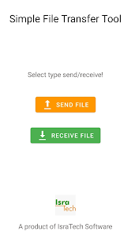
    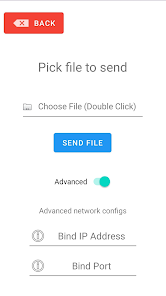
    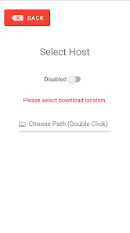
    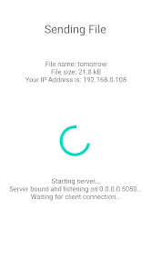
    
Tired of sending files back and forth through Whatsapp, just to transfer them from your PC to your Phone and vice versa? Would you like an AirDrop equivalent for Android and Windows? Well, this is it! Simply pick the file you want to send, and let the receiving device connect to your device and viola!

    
This is a companion app for the <a href='https://github.com/leolion3/Portfolio/tree/master/Python/FileSender' target='_blank'>Python File Transfer Tool <i class="fa fa-external-link"></i></a> found <a href="#file-transfer-ref">above</a>. A Java graphical variant (cross-platform) can be found <a target="_blank" rel="noopener noreferrer" href="https://github.com/leolion3/Simple-File-Transfer-PC">here <i class="fa fa-external-link"></i></a>

    
The source code can be found on <a href="https://github.com/leolion3/Simple-File-Transferer-Android" target="_blank">Github <i class="fa fa-external-link"></i></a>

    	

      

      

	<b style="color:#b5e853">Simple File Transfer Android</b>
      

	  

		
		  {{ p21 | markdownify }}
	  

	  <a href="#simple-file-transfer-android">Back to Top</a>
      

      

      

	<b style="color:#b5e853">Simple File Transfer PC</b>
      

	

		
		  {{ p21 | markdownify }}
	

	<a href="#simple-file-transfer-pc-2">Back to Top</a>
      

    

  
<strong>List of available Distros:</strong>

  <ul style="margin-bottom: 10px;">
    <li><a target="_blank" rel="noopener noreferrer" href="https://github.com/leolion3/Simple-File-Transfer-PC/releases"><i class="fa-solid fa-desktop"></i> PC Release <i class="fa fa-external-link"></i></a></li>
    <li><a target="_blank" rel="noopener noreferrer" href="https://play.google.com/store/apps/details?id=software.isratech.filetransferos"><i class="fa-solid fa-mobile"></i> Android App <i class="fa fa-external-link"></i></a></li>
    <li><a target="_blank" rel="noopener noreferrer" href="https://github.com/leolion3/Portfolio/tree/master/Python/FileSender"><i class="fa-solid fa-terminal"></i> Python CLI Tool <i class="fa fa-external-link"></i></a></li>
    <li><a target="_blank" rel="noopener noreferrer" href="https://github.com/leolion3/Simple-File-Transfer-PC"><i class="fa-solid fa-code"></i> PC Source <i class="fa fa-external-link"></i></a></li>
    <li><a href="https://github.com/leolion3/Simple-File-Transferer-Android" target="_blank"><i class="fa-solid fa-code"></i> Android Source <i class="fa fa-external-link"></i></a></li>
  </ul>
  </li>
<!-- Sharky -->
  <li>
    <h2>
       Sharky the hungry Sharkfish Game <a target="_blank" rel="noopener noreferrer" href="https://play.google.com/store/apps/details?id=com.SpaceAhoy.Sharky">(Google Play <i class="fa fa-external-link"></i>)</a>
    </h2>
    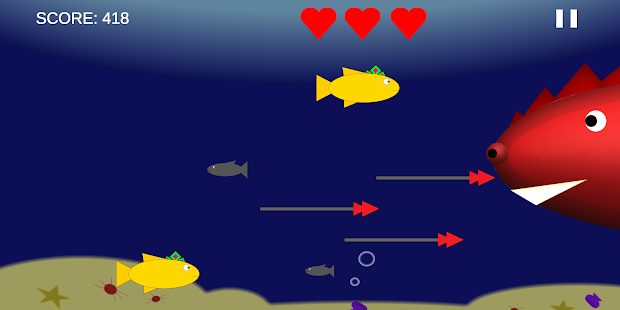
    
Sharky is very Hungry! Help by feeding him as many fish as you can, but watch out for those nasty harpoons! Sharky is a family-friendly game designed for all ages. Furthermore it is completely FREE  and AD-FREE. Collect coins to unlock powerups and new skins, and get that highscore! Sharky is a great time killer for your free time as well!  Be it while waiting at the airport, or in the subway, sharky can played anywhere at any given time!  What are you still waiting for? Get Sharky today!
    

  </li>
<!-- Semesterplaner -->
  <li>
    <h2>
       SemesterPlaner - Plan your Schedule! <a target="_blank" rel="noopener noreferrer" href="https://play.google.com/store/apps/details?id=com.spaceahoy.semesterplaner">(Google Play <i class="fa fa-external-link"></i>)</a>
    </h2>
      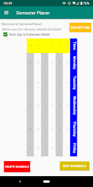
      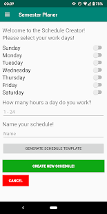
      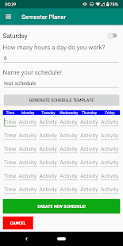
      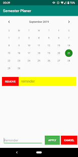
      
Tired of using the same old photoshop template for your semester schedule? Why not automate your schedule creation today using Semester Planer! Just select your work days, how long you work per day and hit that button! Semester Planer will automatically create you a schedule table that can be filled, edited and exported to PNG at any given time!  Stop wasting your time and use Semester Planer today!

  </li>
<!-- Password Generator -->
  <li>
    <h2>
       Open-Source Password Generator App <a target="_blank" rel="noopener noreferrer" href="https://play.google.com/store/apps/details?id=processing.test.password_generator">(Google Play <i class="fa fa-external-link"></i>)</a>
    </h2>
    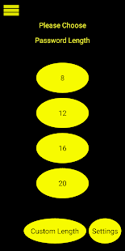
    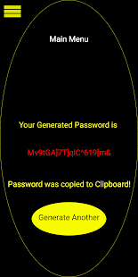
    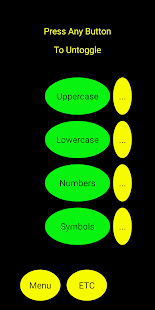
    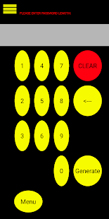
    
Passwords can be a real hustle, especially when you have a thousand accounts for a gazillion different websites... There are some great password generators out there, however how can you ever really trust such a service if it is not open sourced? Stop worrying about your passwords today, with this Free, Open-Source Password Generator! Password Generator is completely FREE and AD-FREE, it works 100% offline an creates you a password in seconds!

    
The source code can be found on <a href="https://github.com/leolion3/App-Tutorial/tree/master/Password_Generator" target="_blank">Github <i class="fa fa-external-link"></i></a>

  </li>
</ul>

<h1 id="contact-section">Contact</h1>

You can contact me using my <a href="mailto:s_xsipo6@uni-bremen.de">email address <i class="fa fa-envelope"></i></a> or on Instagram <a target="_blank" rel="noopener noreferrer" href="https://www.instagram.com/xleolion3">@xleolion3 <i class="fa fa-external-link"></i></a>
