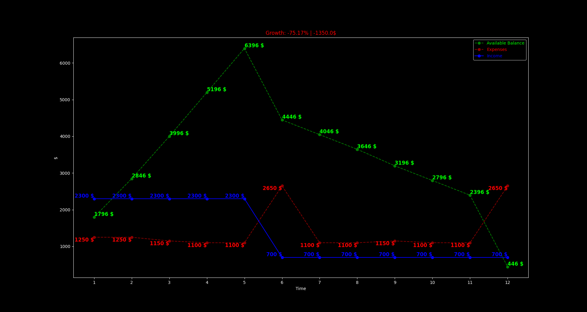

## Welcome, friend

# Who am I?

My name is Leonard Haddad. I am a 21-year-old Israeli-German Computer Science student at the University of Bremen in Germany. 
I've dedicated every little bit of my freetime into learning the basics of networking, studying for the CCNA Certification in addition to learning pentesting, web-dev, and dozens of more things.
This repo provides some of the useful little tools I've created which I personally use on a daily basis.

I am fluent in 4 Languages:
<ul>
    <li>English</li>
    <li>German</li>
    <li>Arabic</li>
    <li>Hebrew</li>
</ul>

A couple programming/scripting/etc languages I use:
<ul>
    <li>Java</li>
    <li>Python</li>
    <li>C#, C and C++</li>
    <li>Haskell</li>
    <li>Powershell</li>
    <li>Batch</li>
    <li>SQL</li>
    <li>Duckyscript</li>
    <li>...</li>
</ul>

I have multiple Google Play Apps that you can find at the bottom of the page. Additionally I am always open for development requests, see the Contact section for this.

All tools provided on this website are free to use and change, misuse however, is prohibited. Any damage caused by these tools, in addition to violations of local restrictions, are your own problem, not mine.  

<hr/>

## Can I use your tools?

Of course! You may also modify them at will. However any trouble caused by them will be your own problem, not mine! :)

<hr/>

## Ok I'm in, where are the tools?

Well you can stick around and take a look at the tools below, or you can go browse the repository!

<h3><a href='https://github.com/leolion3/Portfolio/tree/master/Python/NetworthCalculator' target='_blank'>Bank-Balance Calculator</a></h3>

```

Calculates your bank balance over time taking into account your income,
your expenses and other payments.

```




<h3><a href='https://github.com/leolion3/Portfolio/tree/master/Python/FileSender' target='_blank'>Python File Transfer Tool</a></h3>

```

Send files accross the network with ease using this mega simple tool

```

<h3><a href='https://github.com/leolion3/Portfolio/tree/master/Python/Ethermine' target='_blank'>Ethermine Ticker</a></h3>

```

Check on the fly how much ether you have mined and when the next payout date is!

```

<h3><a href="https://github.com/leolion3/Portfolio/tree/master/Python/ShellGenerator" target="_blank">Powershell TCP Reverse Shell Generator</a></h3>
	
```

Automatically generate Powershell Reverse TCP Payloads using Batch and Python

```

<h3><a href="https://github.com/leolion3/Portfolio/tree/master/Python/Python%20Reverse%20Shell" target="_blank">Python Reverse Shell</a></h3>

```

A very simple reverse shell implementation in Python. Not much more needs to be said.

```

<h3><a href="https://github.com/leolion3/Portfolio/tree/master/Python/MonoalphabeticDecypherer" target="_blank">Monoalphabetic Decypherer</a></h3>

```

A Monoalphabetic-Cypher decypherer, featuring a variety of options, including word-matching and brute-force.

```

<h3><a href="https://github.com/leolion3/Portfolio/tree/master/Python/PasswordVault" target="_blank">Python Password Vault</a></h3>

```
A full-on password vault using multi-layer AES-256 encryption (in a very chaotically smart way)
with a local sqlite database.
- Never use a password manager ever again :)

```

<h3><a href="https://github.com/leolion3/Portfolio/tree/master/Python/Markdown" target="_blank">Python Markdown/Text Editor</a></h3>

```
An easy to use Markdown Text Editor with HTML Preview and Code Execution

```

<h3><a href="https://github.com/leolion3/Portfolio/tree/master/Python/YouTube" target="_blank">YouTube MP3 Downloader</a></h3>

```
Download any YouTube video to MP3 in Seconds using this tool.
Supports both single videos and entire playlists.

```

<h3><a href="https://github.com/leolion3/Portfolio/tree/master/CustomCommands" target="_blank">Custom Windows Commands and Git Shortcuts</a></h3>

<hr/>

# More from Me

Check out my Google Play Apps!

<h2>
	
</h2>
<ul>
  <li>
		<h2>
			 Sharky the hungry Sharkfish Game <a target="_blank" href="https://play.google.com/store/apps/details?id=com.SpaceAhoy.Sharky">(Google Play)</a>
		</h2>
	  
		<p>
			Sharky is very Hungry! Help by feeding him as many fish as you can, but watch out for those nasty harpoons!<br />
	  	Sharky is a family-friendly game designed for all ages. Furthermore it is completely FREE<br /> and AD-FREE. Collect coins to unlock powerups and new skins, and get that highscore!<br />
	  	Sharky is a great time killer for your free time as well!<br /> Be it while waiting at the airport, or in the subway, sharky can played anywhere at any given time!<br /> What are you still waiting for? Get Sharky today!
		</p>
	</li>

  <li>
		<h2>
			 SemesterPlaner - Plan your Schedule! <a target="_blank" href="https://play.google.com/store/apps/details?id=com.spaceahoy.semesterplaner">(Google Play)</a>
		</h2>
		
		
		
		
		<p>Tired of using the same old photoshop template for your semester schedule?<br />
		Why not automate your schedule creation today using Semester Planer!<br />
		Just select your work days, how long you work per day and hit that button!<br />
		Semester Planer will automatically create you a schedule table that can be filled,<br />edited and exported to PNG at any
		given time!<br /> Stop wasting your time and use Semester Planer today!</p>
	</li>

  <li>
		<h2>
			 Open-Source Password Generator App <a target="_blank" href="https://play.google.com/store/apps/details?id=processing.test.password_generator">(Google Play)</a>
		</h2>
	  
	  
	  
		
	  <p>
			Passwords can be a real hustle, especially when you have a thousand accounts for a gazillion different websites...<br />
	  	There are some great password generators out there, however how can you ever really trust such a service if it is not open sourced?<br />Stop worrying about your passwords today, with this Free, Open-Source Password Generator!<br />
			Password Generator is completely FREE and AD-FREE, it works 100% offline an creates you a password in seconds!<br />
			The source code can be found on <a href="https://github.com/leolion3/App-Tutorial/tree/master/Password_Generator" target="_blank">Github</a>
		</p>
	</li>
</ul>

<hr/>

# Contact

You can contact me using my <a href="mailto:s_xsipo6@uni-bremen.de">email address</a>, or on Instagram <a target="_blank" href="https://www.instagram.com/xleolion3">@xleolion3</a>
